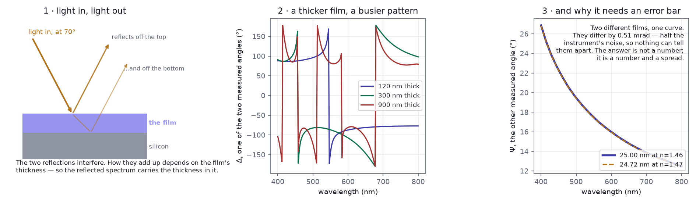
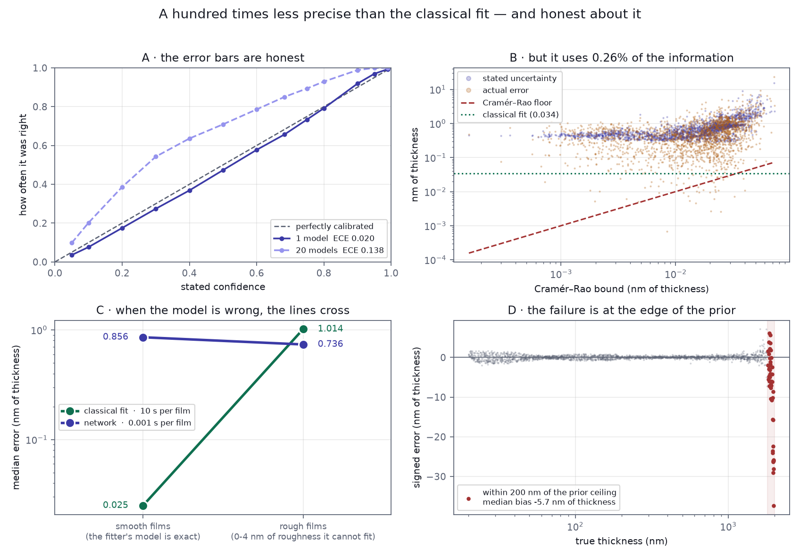
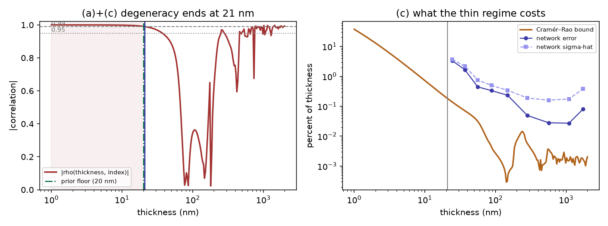

# differentiable-thin-film-metrology

Measuring how thick a film is from the light it reflects — and working out when
that measurement should not be trusted.

## What the problem is



Shine light at a transparent film and it reflects twice — once off the top
surface, once off the film–substrate boundary underneath. Those two reflections
interfere, and how they add up depends on how far the second one travelled. So
the pattern of colours coming back carries the film's thickness inside it.

Reading the thickness back out is the hard direction. **Panel 3 is the whole
difficulty in one picture:** a 25.00 nm film and a 24.72 nm film made of slightly
different material produce spectra 0.51 mrad apart — *half* the instrument's own
noise. No method can separate them, so the honest answer is not a thickness but a
thickness and a spread.

That is what this project measures: not just how thick, but how sure.

---

## The result



**A neural network inverts spectroscopic ellipsometry about 9,000× faster than a
classical fit and about 100× less precisely — and its error bars are honest about
exactly that** (expected calibration error 0.020, against 0 for a perfect model).
On films whose physics the classical model describes exactly it is beaten 34×; on
films carrying surface roughness the classical model cannot represent, it wins.
The interesting result is not the speed, which is unsurprising, but that a fast
estimator can say how much it is giving up.

---

## The numbers

| | classical fit | network (20-model ensemble) |
|---|---|---|
| median error, smooth films | **0.025 nm** of thickness | 0.856 |
| median error, rough films | 1.014 | **0.736** |
| time per film | 10.1 s | **0.0011 s** |
| information used (Cramér–Rao efficiency) | **26%** | 0.26% |
| calibrated uncertainty | from the fit covariance | ECE **0.020** (single model) |

Films are 20–2000 nm of thickness on silicon, measured as Ψ and Δ over 200
wavelengths from 400–800 nm at 70° incidence, with 1 mrad of instrument noise.

**What the four panels say.** *(A)* Stated confidence matches how often the model
is right. *(B)* Both the stated uncertainty and the actual error sit far above the
Cramér–Rao floor — the physical limit on what any unbiased estimator could
achieve — and never below it. *(C)* Give both methods films with 0–4 nm of surface
roughness, which the three-parameter fit has no term for, and the lines cross.
*(D)* The network is unbiased everywhere except within 200 nm of the prior's
ceiling, where the output sigmoid saturates.

---

## Why this is not just a regression problem



Given a film's parameters, computing the spectrum is exact and cheap. Going
backwards is neither. Thickness and refractive index trade off against each
other, and below about **21 nm of thickness** they stop being separable at all —
the correlation between them exceeds 0.99, and at 1 nm the uncertainty floor is
**37% of the film**. That threshold, `d/λ ≈ 0.035`, is where the measurement
itself gives out; no algorithm recovers what is not there.

The right-hand panel is the honest scorecard: the network's error tracks the
physical floor's shape but sits far above it, and its stated uncertainty follows
— though it under-reacts to the thin regime by about a factor of two.

That is why the uncertainty matters more than the accuracy. A thickness is
useful; a thickness that knows when it is guessing is what a fab can act on.

The forward model is written from scratch in PyTorch and **differentiable
throughout**, which is what makes the central comparison possible: the Fisher
information gives a Cramér–Rao bound per film, so "how good is this estimator"
has a physical answer rather than a relative one.

---

## Running it

```bash
python -m venv .venv && source .venv/bin/activate
pip install -e ".[dev]"
pytest                                     # ~900 tests, about 10 minutes
```

Reproduce the headline figure from trained models:

```bash
python scripts/train.py --config configs/train.yaml       # one model, ~2.5 h
python scripts/calibration_figure.py --members runs/members.npz
```

Training sweeps run on GitHub Actions rather than a laptop — twenty in parallel,
each checkpointed and resumable:

```bash
gh workflow run sweep.yml -f config=configs/sweep.yaml -f runs=20
gh run download <id> -D incoming/
python scripts/collect_runs.py incoming/
```

---

## Reading it

Three notebooks carry the narrative; everything computational lives in `src/`.
A fourth, on calibration and failure, is DTFM-056 and not yet written.

| | |
|---|---|
| [`01_simulator_validation.ipynb`](notebooks/01_simulator_validation.ipynb) | the forward model, and three independent checks that it is right |
| [`02_baseline.ipynb`](notebooks/02_baseline.ipynb) | the classical fit — the ruler everything else is measured against |
| [`03_training.ipynb`](notebooks/03_training.ipynb) | the network, and what 271 training runs actually settled |

| module | |
|---|---|
| `tmm_torch.py` | transfer-matrix optics, differentiable, branch-cut safe |
| `dispersion.py` | Cauchy, Sellmeier, Lorentz; `refractiveindex.info` loader |
| `noise.py` | roughness, bandwidth, non-uniformity, drift |
| `baseline.py` | Levenberg–Marquardt and multi-start inversion |
| `uncertainty.py` | Fisher information, Cramér–Rao bounds, identifiability |
| `models.py` | MLP and 1D CNN inverse models, uncertainty head, ensembles |
| `losses.py` | Gaussian NLL and the physics reconstruction term |
| `calibration.py` | coverage, reliability diagrams, expected calibration error |
| `training.py` | config-driven runs, checkpointing, resumable sweeps |

---

## What this does not do

Stated here rather than buried, because the limitations are the part most
worth knowing.

- **Synthetic data only.** Every film comes from the project's own forward model.
  The misspecification result in panel C is a *simulated* mismatch — real wafers
  carry interfacial oxide, non-uniformity, and backside reflections that no test
  here includes.
- **The network is far from optimal.** 0.26% Cramér–Rao efficiency means it throws
  away most of the information in the measurement. It is a fast, robust, honest
  estimator, not a precise one.
- **The ensemble's uncertainty is miscalibrated**, even though a single model's is
  not. Averaging twenty members shrinks the error without shrinking any member's
  stated σ̂, so the intervals grow too wide (ECE 0.020 → 0.138). A fitted
  correction on held-out data would fix it; that is not done yet.
- **A Gaussian head cannot represent a bimodal posterior.** Fringe-order ambiguity
  can produce one. In this data the errors are unimodal — the broadband spectrum
  resolves it — so the limitation is latent rather than active, but it is there.
- **Edge-of-prior bias.** Within 200 nm of the 2000 nm ceiling the network
  under-predicts by a median 5.7 nm of thickness. 2.3% of films.

---

## Reproducibility

Every result is generated from a config that is saved beside the weights that
produced it. Runs record their seed, commit, machine and PyTorch version, and
`runs/history.jsonl` holds every training run the project has made.

Two things that are *not* reproducible are recorded rather than hidden: training
is not bit-identical across machines, because floating-point summation order
differs between BLAS kernels — measured at 1.0% for the MLP and 21.8% for the CNN
under MSE — and timing figures depend on which runner a job landed on.
